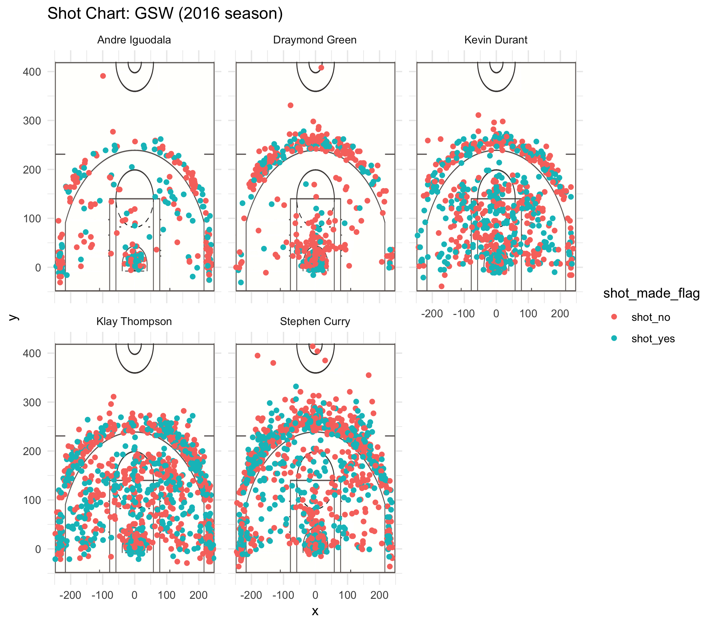

Workout 01
================
Eunice Sou



Effective Shooting Percentage
-----------------------------

``` r
tables <- read.csv("../data/shots-data.csv", header = TRUE)
```

2PT Effective Shooting % by Player Table
----------------------------------------

``` r
library(dplyr)
```

    ## 
    ## Attaching package: 'dplyr'

    ## The following objects are masked from 'package:stats':
    ## 
    ##     filter, lag

    ## The following objects are masked from 'package:base':
    ## 
    ##     intersect, setdiff, setequal, union

``` r
arrange(summarise(group_by(tables, name), total = sum(shot_type == "2PT Field Goal"), made = sum(shot_made_flag == "shot_yes" & shot_type == "2PT Field Goal"), percentage = made/total), desc(percentage))
```

    ## # A tibble: 5 x 4
    ##   name           total  made percentage
    ##   <fct>          <int> <int>      <dbl>
    ## 1 Andre Iguodala   210   134      0.638
    ## 2 Kevin Durant     643   390      0.607
    ## 3 Stephen Curry    563   304      0.540
    ## 4 Klay Thompson    640   329      0.514
    ## 5 Draymond Green   346   171      0.494

3PT Effective Shooting % by Player Table
----------------------------------------

``` r
arrange(summarise(group_by(tables, name), total = sum(shot_type == "3PT Field Goal"), made = sum(shot_made_flag == "shot_yes" & shot_type == "3PT Field Goal"), percentage = made/total), desc(percentage))
```

    ## # A tibble: 5 x 4
    ##   name           total  made percentage
    ##   <fct>          <int> <int>      <dbl>
    ## 1 Klay Thompson    580   246      0.424
    ## 2 Stephen Curry    687   280      0.408
    ## 3 Kevin Durant     272   105      0.386
    ## 4 Andre Iguodala   161    58      0.360
    ## 5 Draymond Green   232    74      0.319

Effective Shooting % by Player Table
------------------------------------

``` r
arrange(summarise(group_by(tables, name), total = sum(shot_type == "2PT Field Goal" | shot_type == "3PT Field Goal"), made = sum(shot_made_flag == "shot_yes"), percentage = made/total), desc(percentage))
```

    ## # A tibble: 5 x 4
    ##   name           total  made percentage
    ##   <fct>          <int> <int>      <dbl>
    ## 1 Kevin Durant     915   495      0.541
    ## 2 Andre Iguodala   371   192      0.518
    ## 3 Klay Thompson   1220   575      0.471
    ## 4 Stephen Curry   1250   584      0.467
    ## 5 Draymond Green   578   245      0.424

Narrative
---------

### Introduction:

The Golden State Warriors won the NBA championship for the 2016 season. They nearly became the first team to complete a perfect postseason, reeling off a record-setting 15-game postseason winning streak, and secured the franchise’s second championship in three years in Game 5 after just losing out to the Cleveland Cavaliers in Game 4. This report is done to show the effective shooting percentages of the main players of the starting lineup for GSW throughout the 2016 season.

### Motivation:

This report is done to compare and observe the shooting percentgaes of each of the players of the starting lineup of the Golden States Warriors team for the 2016 season.

### Background:

2PT Field Goal and 3PT Field Goal refers to whether a successful field goal was scored correctly as a 2-point or 3-point field goal. Effective Field Goal records the combined total of field goals made overall.

### Data:

The data values are calculated from data sets which recorded the total number of shots attempted, the number of shots made, and the shot type (2points or 3points) by each individual player. Then, the effective shooting percentages combines the overall total number of 2point shots and 3point shots made.

### Analysis:

Starting from analyzing the 2points effective shooting percentage, Andre Iguodala has the highest percentage of making the shots, topping the list at an impressive 0.6380%. However, compared to his 3points shooting percentage, he has one of the lowest percentages of 0.3602%.

Draymond Green has the least effective shooting percentages for both 2points and 3points at 0.4942 % and 0.3189% respectively, compared to his other teammates. His shooting percentage is pretty low as seen from his image, with most of the shots he made to be red, representing shots not made.

Kevin Durant has a pretty high 2points effective shooting percentage at 0.6065 % and this is pretty impressive considering the fact that he managed to score 390 out of the 643 total shots made, one of the highest in the team. This highlights the consistency of his shooting in the 2points range, emphasizing his accuracy in the 2points range.

On the other hand, he has a pretty decent effective shooting percentage for 3points at 0.3860%, placing him just below fellow teammates and shooting guards Klay Thompson and Stephen Curry.

From the image of his shot charts, the shots made by him were more spread out compared to the previous two teammates, with a much higher percentage of shots made within the 2points range than outside the 3points line.

Klay Thompson, though his effective shooting percentage for 2points is only 0.5140%, compared to his other teammates and fellow shooting guards, it is important to note that he had in fact made a large number of shots as compared to his other teammates.

Stephen Curry on the other hand has a 0.5399645 2PT effective shooting percentage and a 0.4075691 3PT effective shooting percentage. This gives a total of 0.4672000 effective shooting percentage overall, placing him fourth the list. However, it is interesing to note that he had took the most number of shots out of all the other players totaling up to 1250 shots, and still managed to make the most number of shots.

### Discussion:

Andre Iguodala plays the position of a shooting guard or small forward on the team. With a height of 6-foot-6, playing the position of shooting guard, and while no great marksman, he has a knack for knocking down big shots. Iguodala is a widely respected veteran who, as a budding college star on the way to becoming the No. 9 pick (by Philadelphia) in the 2004 draft. He can be a small forward who can guard much bigger forwards, a defensive stalwart who bodied up on James in the 2015 finals, making life trying for the N.B.A.’s most combustible package of power and speed.

However, it is interesting to note that Andre Iguodala made the least number of total shots compared to the other players.

For the 2016 season, the statistically brilliant folks at Nylon Calculus broke down Curry’s shots from 2011-2016. Accounting for free throws, Curry averaged 1.36 points per shot from 0-3 feet.

But from 24 to 28 feet, Curry averaged an even better 1.37 points per shot. And it gets even crazier! From 28-30 feet (the deep, deep triples), Curry averaged 1.35 points per shot.

In other words, Curry is almost identically efficient when shooting from 28-30 feet as he is from 0-3 feet. That is simply unreal.

Overall, as a team, Golden State Warriors are on pace to be just the fourth team in the last 20 years to make more than half their shots. And when you factor in the value of 3-pointers, their shots are more valuable than any of the 1,483 other teams that have played in this league.

Along with fewer shots in the paint have come fewer trips to the free throw line. Even though they're playing at a faster pace than last season and shooting better from the line, the Warriors have scored 1.1 fewer points per game on free throws.

Still, the shooting. It was great before and it's better now. And you can make up for other deficiencies by putting the ball in the basket more effectively than any team in NBA history.

### Conclusion:

Even though Stephen Curry doesn’t have the highest overall shooting percentage compared to players like Andre Iguodala, it does not necessary mean that he is as worse shooter than he it. In fact, considering the fact that he had actually made the most number of shots compared to all the other players, yet managed to maintain a 0.4672 percent of shooting percentage highlights his consistency and shooting skills.

Klay Thompson ranks eighth in the league with 143 mid-range attempts, and Curry, Thompson, and Kevin Durant are three of only nine players who have shot 50 percent or better on at least 50.

For the Warriors and for a league as a whole, shots in the paint are worth more than shots from outside the paint. The champs are one of nine teams that have taken less than 30 percent of their shots from the restricted area, the area of the floor that yields the most points per attempt (1.3). The Warriors have been depending on their jumpers a little more than they have in the past. This season, 58 percent of their shots, the third highest rate in the league (and up from 56 percent last season), have come from outside the paint.

Other than just simply looking at the percentages, Quantified shot quality, or QSQ, accounts for shot location, defender location and what type of shot it was (catch-and-shoot, off the dribble, etc.), among other variables, is also crucial is determining how great of a shooter the player is. We can use this same metric to identify shots off passes, too, and no player created higher-quality looks for his teammates than Steph Curry. When Curry passes to a teammate, if that teammate were a league-average shooter from that spot, they would have an effective Field Goal percentage of 57.9 percent, first in the NBA and well above the league average.

It is crucial to remember to not just look at the values by themselves, but also at the sample sizes. Curry nailed more 3s than everyone on the Bucks combined in 2016. Better yet: since Dec. 1. Furthermore, Steph made 39 more 3s over this season and last (688) than Larry Bird did in his 13-year career (649). Curry has hit 107 more in that span than MJ did (581) in his 15 years.

(1283 words)

### References:

<http://www.espn.com/espn/feature/story/_/id/15492948/the-numbers-steph-curry-incredible-mvp-season>

<https://www.goldenstateofmind.com/2018/2/21/17010344/2018-nba-golden-state-warriors-steph-curry-efficiency-deep-threes-layups>

<https://shottracker.com/articles/are-the-warriors-making-the-mid-range-relevant-again>

<https://www.nba.com/warriors/gameday/20161103/recap>

<https://www.sfchronicle.com/warriors/article/Stephen-Curry-nearly-automatic-from-the-12310503.php>

<https://www.nytimes.com/interactive/2017/06/17/sports/basketball/golden-state-warriors-post-season.html>
